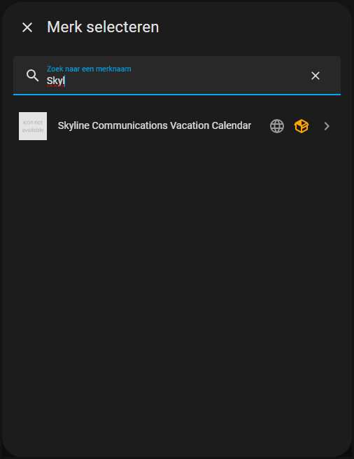
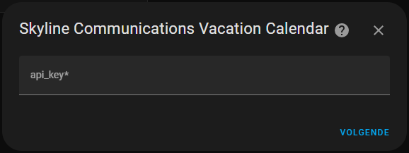
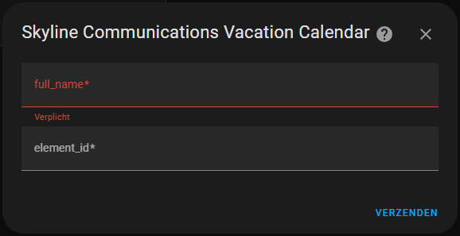
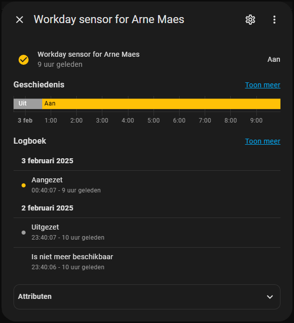

# Home Assistant RecycleApp Integration

Home Assistant Integration to sync your Skyline Communications Vacation Calendar with your HA. 

## Installation

For now there is no easy way of installing. You can for example 
* Install the File Editor Add-On:
* In the File Editor create a **custom_components** folder.
* In the custom_components folder create a **skyline_communications_vacation_calendar** folder
* In the skyline_communications_vacation_calendar folder add all the .py files from this repo (except for the *test.py*) and also the *manifest.json*, *quality_scale.yaml* and the *strings.json*
* Reboot your Home Assistant

## Setup

### Step 1: Find the correct element

* Go to the [domain-metrics-cloud](https://domainmetrics-skyline.on.dataminer.services/) DMA (or via the local address, you'll need to be connected to HQ to use this: [domain-metrics-local](https://domain-metrics.skyline.local/))
* Find the element running the **Skyline Squad Time Logs Acquirer** that contains the calendar information for the user you want to setup. For instance for me the element is called "*Media & Broadcast HFC - Time*" with element id "*477/147*", Note down what the element id is for your use case. The element id should always be 2 numbers with a forward slash in between.
* Open the element and navigate to the Calendar page. Take note of the exact name of the rows you want to get calendar information for. In my case it's "*Arne Maes*".

### Step 2: Setup the integration

* Go to the Integrations page and press the Add Integration button.
* Search for **Skyline Communications Vacation Calendar**.

* Fill in the API Key (you'll need to request one first, you can just text me for a key).

* Fill in your exact name and element id (the one you got from step 1).

* Press submit and your setup is complete.

## Usage

For now this will create 1 entity per integration (with more to come). It's a binary sensor indicating of today is a workday for the user or not. You could then the sensor in automations, for instance heat the car when my alarm goes of on a workday.

## Support

For additional help, reach out to [arne.maes@skyline.be](mailto:arne.maes@skyline.be)